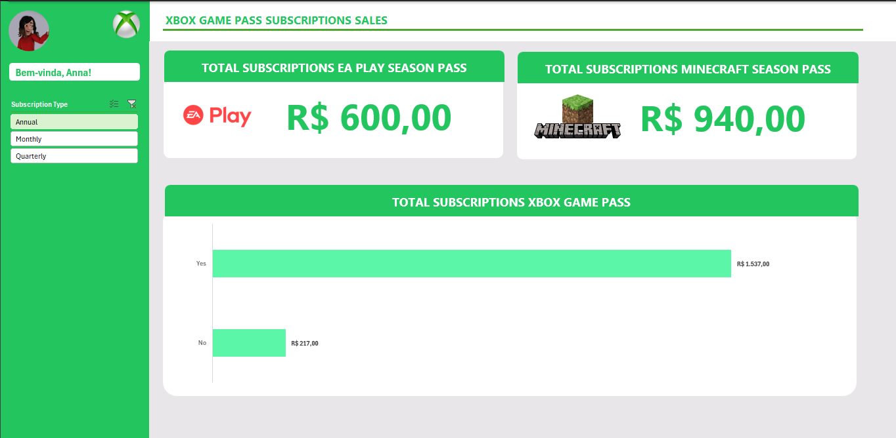

# 📊 Dashboard de Vendas - Xbox Game Pass Subscriptions

## 📝 Descrição

Projeto de desenvolvimento de um **dashboard interativo de vendas**, focado na **organização** e **visualização de dados**.  
O objetivo principal é transformar **dados brutos** em **informações visuais claras e úteis**, facilitando a **análise do desempenho** das vendas e a **tomada de decisões** baseadas em dados.

Este projeto foi **desenvolvido com a DIO (Digital Innovation One)**, como parte de uma formação voltada para **Inteligência Artificial**, **Ciência de Dados** e **Visualização de Dados**.

## 🎯 Funcionalidades

✅ Visualização do total de assinaturas do **EA Play Season Pass**  
✅ Visualização do total de assinaturas do **Minecraft Season Pass**  
✅ Gráfico de barras representando o total de assinaturas do **Xbox Game Pass** com separação por status ("Sim" ou "Não")  
✅ Filtro por **tipo de assinatura**:
- Anual  
- Mensal  
- Trimestral  

✅ Interface amigável e intuitiva  
✅ Layout responsivo e organizado  

## 🛠️ Tecnologias Utilizadas

- **Excel** (ou **Power BI**) para visualização e manipulação dos dados  
- **Gráficos dinâmicos** e **segmentação de dados**  
- **Visualização de KPIs** (indicadores chave de performance)  
- **Integração de imagens** e **elementos gráficos** para melhor usabilidade  

## 🧠 Conceitos Aplicados

- **Data Visualization**: transformar dados complexos em gráficos e indicadores claros  
- **Inteligência Artificial (IA)** e **Ciência de Dados**: apoio na modelagem e análise dos dados  
- **User Experience (UX)**: foco na apresentação limpa, intuitiva e eficaz

## 📌 Estrutura do Dashboard

- **Sidebar**: filtro por tipo de assinatura  
- **KPI Cards**: total de receita das assinaturas EA Play e Minecraft  
- **Gráfico de barras**: distribuição do total de assinaturas com e sem Xbox Game Pass  

## 🚀 Como Utilizar

1. Importar a base de dados de assinaturas  
2. Atualizar os gráficos dinâmicos conforme as vendas  
3. Utilizar os filtros para visualizar diferentes tipos de assinatura  
4. Analisar os indicadores para apoiar a tomada de decisões  

## 💡 Benefícios

- Clareza na **análise de desempenho** das assinaturas  
- Apoio na **tomada de decisões estratégicas**  
- Facilidade de **identificação de tendências** e **comportamentos de consumo**  

## 📷 Imagem do Dashboard

## 👩‍💻 Autoria

Desenvolvido por: **Luara**  

Projeto realizado com: **DIO - Digital Innovation One**
